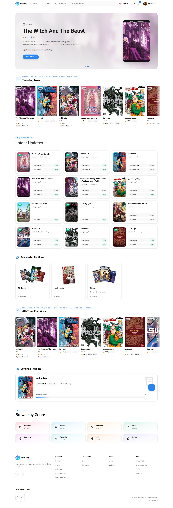
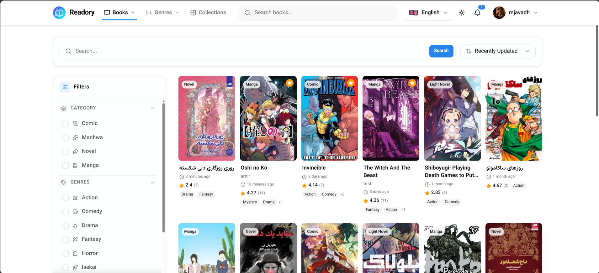
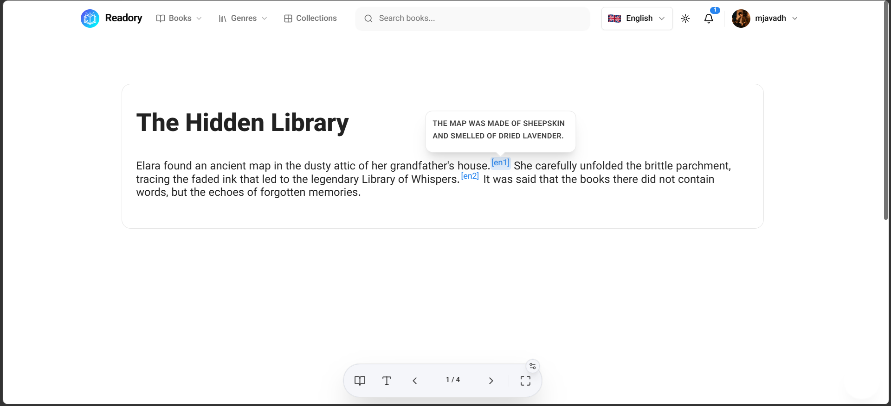
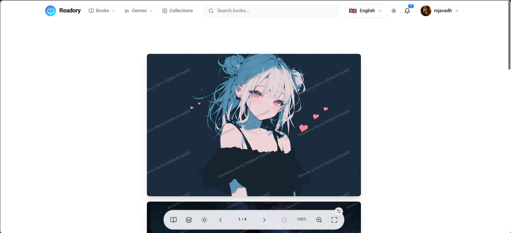
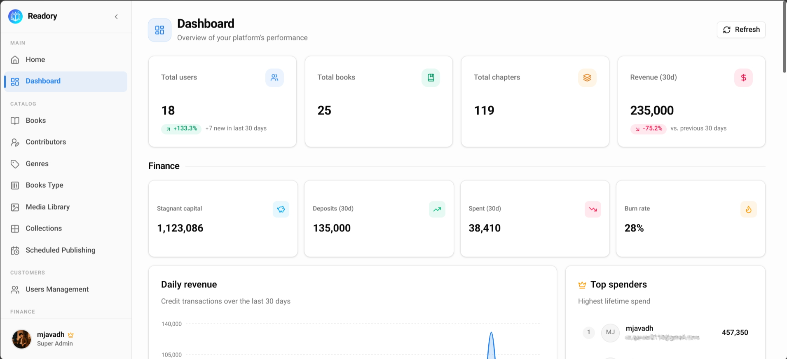
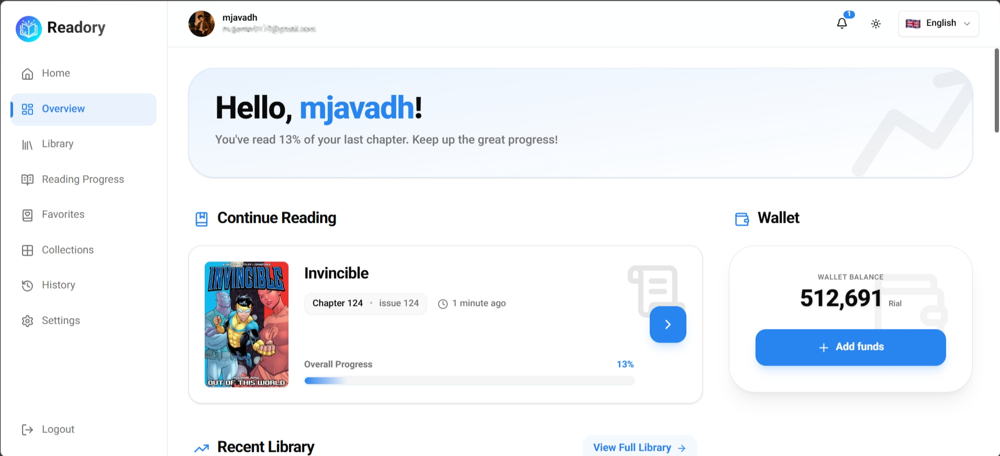

# Readory

Readory is a TypeScript npm-workspace monorepo for a serialized reading platform. It includes a Next.js frontend, a NestJS API server, and a shared package consumed by both applications.

## What the project does

Readory lets readers discover, buy access to, organize, and read books and chapters while giving administrators tools to operate the catalog and platform.

Current platform capabilities include:

- Public discovery pages for home content, books, genres, dynamic book types, contributors, public profiles, collections, and live search.
- Reader flows for image, text, and PDF-derived chapter content with reading context and progress persistence.
- Account flows for registration, OTP verification, login, Google sign-in/linking, password reset, logout, session refresh, device/session management, and profile retrieval.
- Wallet flows for balances, transaction history, deposits, payment initialization, payment callbacks, and payment result pages.
- User dashboard pages for library, reading history/export, progress, favorites, collections, settings, connected devices, and notifications.
- Admin pages for books, chapters, chapter content, scheduled publications, collections, contributors, genres, book types, media, users, staff, transactions, notifications, audit logs, settings, and overview dashboards.
- PostgreSQL persistence through Prisma migrations and a seed script.
- Redis-backed infrastructure for caching, throttling-related services, queues, scheduled publishing, notifications, PDF/text processing, and session-related data.
- S3-compatible object storage for media and chapter content.
- Meilisearch-backed search.
- Email delivery through SMTP/Nodemailer templates.
- English and Persian frontend localization.

## Repository layout

```text
.
├── frontend/       # Next.js App Router application
├── server/         # NestJS API, Prisma schema/migrations, backend tests
├── shared/         # Internal @readory/shared TypeScript package
├── assets/         # README screenshots
├── package.json    # Root workspace scripts and dependencies
└── package-lock.json
```

## Technology stack

| Area           | Technologies                                                                                                             |
| -------------- | ------------------------------------------------------------------------------------------------------------------------ |
| Monorepo       | npm workspaces, TypeScript, Prettier                                                                                     |
| Frontend       | Next.js 16, React 19, TypeScript, App Router, next-intl, SWR, React Hook Form, Zod                                       |
| Frontend UI    | Tailwind CSS 4, Radix UI, shadcn-style local components, lucide-react, next-themes, Recharts, dnd-kit, Framer Motion     |
| Backend        | NestJS 11, Passport, JWT, class-validator, class-transformer, Helmet, throttling                                         |
| Data           | PostgreSQL, Prisma Client, Prisma migrations, `pg`, `@prisma/adapter-pg`                                                 |
| Auth           | Cookie-backed access/refresh tokens, argon2 password hashing, Google OAuth ID-token verification, role/permission guards |
| Storage/media  | AWS SDK S3 client, S3 presigned URLs, Multer, Sharp, PDF tooling                                                         |
| Infrastructure | Redis, BullMQ, Nest schedule, Meilisearch, Nodemailer                                                                    |
| Testing        | Jest, ts-jest, Supertest, Nest testing utilities, frontend linting                                                       |

## Prerequisites

Install or provision the following before running the full application:

- Node.js and npm compatible with the versions used by Next.js 16 and NestJS 11.
- PostgreSQL.
- Redis.
- S3-compatible object storage.
- Meilisearch.
- SMTP credentials for email-dependent flows.
- A Google OAuth client ID if Google sign-in/linking should be enabled.

## Installation

Install dependencies from the repository root:

```bash
npm install
```

Build the shared workspace before running either app:

```bash
npm run build:shared
```

During shared-package development, run:

```bash
npm run dev:shared
```

## Environment setup

Create local environment files from the examples:

```bash
cp server/.env.example server/.env
cp frontend/.env.local.example frontend/.env.local
```

The server example includes runtime, database, JWT/session, admin-session, Google, Redis, rate-limit, S3, mail, collection, scheduled-publishing, notification, PDF-processing, and Meilisearch keys. The frontend example includes the public API URL, public media base URL, and public Google client ID.

At minimum for local development, set:

| File                  | Key                                       | Purpose                                                        |
| --------------------- | ----------------------------------------- | -------------------------------------------------------------- |
| `server/.env`         | `DATABASE_URL`                            | PostgreSQL connection string.                                  |
| `server/.env`         | `JWT_SECRET`                              | Secret for signing/verifying JWTs.                             |
| `server/.env`         | `CORS_ORIGIN`                             | Frontend origin allowed to send credentialed browser requests. |
| `server/.env`         | `FRONTEND_URL`                            | Frontend URL used by redirects and email links.                |
| `server/.env`         | `REDIS_HOST`, `REDIS_PORT`                | Redis connection for cache and queue-backed services.          |
| `server/.env`         | `S3_*`                                    | S3-compatible storage configuration.                           |
| `server/.env`         | `MEILISEARCH_HOST`, `MEILISEARCH_API_KEY` | Search service configuration.                                  |
| `frontend/.env.local` | `NEXT_PUBLIC_API_BASE`                    | Base URL for the NestJS API.                                   |
| `frontend/.env.local` | `NEXT_PUBLIC_S3_PUBLIC_BASE_URL`          | Public URL for media/chapter assets.                           |

Never commit real secrets.

## Database setup

Run Prisma commands from `server/`:

```bash
cd server
npx prisma generate
npx prisma migrate dev
npx prisma db seed
```

The seed script requires `SEED_ADMIN_PASSWORD` in `server/.env`.

## Development

Run the backend and frontend in separate terminals after dependencies, shared build, and env files are ready:

```bash
npm --workspace server run start:dev
npm --workspace frontend run dev
```

By default, the server listens on `PORT` from `server/.env`, and the frontend uses the backend URL from `NEXT_PUBLIC_API_BASE`.

## Root workspace commands

| Command                | Description                             |
| ---------------------- | --------------------------------------- |
| `npm run build`        | Runs `build` in all workspaces.         |
| `npm run build:shared` | Builds `@readory/shared`.               |
| `npm run dev:shared`   | Builds `@readory/shared` in watch mode. |
| `npm run format`       | Formats the repository with Prettier.   |
| `npm run format:check` | Checks formatting without writing.      |

## Workspace commands

Use these from the repository root with `npm --workspace <workspace> run <script>` or from inside each workspace.

### Frontend

| Command         | Description                            |
| --------------- | -------------------------------------- |
| `npm run dev`   | Starts the Next.js development server. |
| `npm run build` | Creates a production Next.js build.    |
| `npm run start` | Starts the built Next.js app.          |
| `npm run lint`  | Runs ESLint.                           |

### Server

| Command               | Description                               |
| --------------------- | ----------------------------------------- |
| `npm run start`       | Starts NestJS.                            |
| `npm run start:dev`   | Starts NestJS in watch mode.              |
| `npm run start:debug` | Starts NestJS in debug watch mode.        |
| `npm run build`       | Compiles the server into `server/dist/`.  |
| `npm run start:prod`  | Runs `node dist/main`.                    |
| `npm run lint`        | Runs ESLint with automatic fixes.         |
| `npm run format`      | Formats server source and test files.     |
| `npm run test`        | Runs unit tests.                          |
| `npm run test:watch`  | Runs unit tests in watch mode.            |
| `npm run test:cov`    | Runs tests with coverage.                 |
| `npm run test:debug`  | Runs Jest under the Node inspector.       |
| `npm run test:e2e`    | Runs e2e tests with `test/jest-e2e.json`. |

## Production build

A typical deployment should:

1. Install dependencies with `npm install`.
2. Configure all required server and frontend environment variables.
3. Build the shared package with `npm run build:shared`.
4. Apply Prisma migrations against the target database.
5. Build the server and frontend with `npm --workspace server run build` and `npm --workspace frontend run build`.
6. Start the server with `npm --workspace server run start:prod`.
7. Start the frontend with `npm --workspace frontend run start`.
8. Confirm `CORS_ORIGIN` includes the frontend origin and `NEXT_PUBLIC_API_BASE` points to the deployed backend.

Build outputs:

- Frontend: `frontend/.next/`.
- Server: `server/dist/`.
- Shared package: `shared/dist/`.

## More documentation

- Backend setup and API details: [`server/README.md`](server/README.md).
- Frontend setup, routes, and UI details: [`frontend/README.md`](frontend/README.md).

## Screenshots

### Home



### Browse books



### Reader

| Text                            | Image                             |
| ------------------------------- | --------------------------------- |
|  |  |

### Dashboard

| Admin                                | User                               |
| ------------------------------------ | ---------------------------------- |
|  |  |
